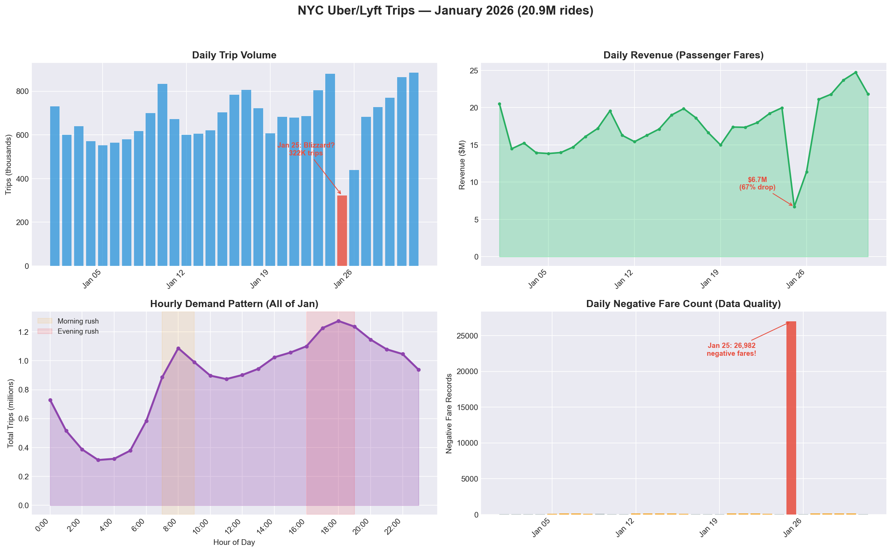

# data-detective

An MCP server that gives AI assistants the ability to connect to, query, profile, and monitor data sources — turning any LLM into an interactive data engineering copilot.

Point it at any SQLite database, Parquet file, or CSV and let your AI assistant explore schemas, run queries, profile columns, detect data quality issues, and export clean datasets — all through natural conversation.

## Features

| Tool | Description |
|---|---|
| `connect_source` | Register a SQLite, Parquet, or CSV data source |
| `disconnect_source` | Remove a connected data source |
| `list_sources` | List all connected sources and their tables |
| `list_tables` | List all tables across all sources |
| `get_table_schema` | Describe columns, types, and nullability |
| `run_query` | Execute SQL against any connected source (DuckDB) |
| `get_sample` | Random sample of N rows from a table |
| `profile_table` | Column-level stats: null rates, distributions, min/max/mean/median |
| `detect_quality_issues` | Find duplicates, high null rates, constant columns, unexpected negatives |
| `detect_anomalies` | Z-score based anomaly detection on numeric columns |
| `compare_schemas` | Diff schemas between two tables |
| `summarize` | High-level summary across all connected data |
| `export_data` | Export query results to Parquet or CSV |

## Architecture

```
┌──────────────────────────────────────────────┐
│              AI Assistant (LLM)              │
│         Claude, GPT, Copilot, etc.           │
└──────────────────┬───────────────────────────┘
                   │  MCP Protocol
┌──────────────────▼───────────────────────────┐
│            data-detective                    │
│                                              │
│  ┌─────────────────────────────────────────┐ │
│  │             MCP Tools Layer             │ │
│  │  connect · query · profile · quality ·  │ │
│  │  export · anomalies · schemas           │ │
│  └──────────────────┬──────────────────────┘ │
│                     │                        │
│  ┌──────────────────▼──────────────────────┐ │
│  │          Source Registry                │ │
│  │     Manages connections & routing       │ │
│  └──────────────────┬──────────────────────┘ │
│                     │                        │
│  ┌──────────────────▼──────────────────────┐ │
│  │          DuckDB Query Engine            │ │
│  │   Single SQL dialect across all sources │ │
│  └──────┬───────────┬──────────────┬───────┘ │
│         │           │              │         │
│    ┌────▼───┐ ┌─────▼────┐ ┌──────▼───┐     │
│    │ SQLite │ │ Parquet  │ │   CSV    │     │
│    └────────┘ └──────────┘ └──────────┘     │
└──────────────────────────────────────────────┘
```

## Quick Start

### Prerequisites

- Python 3.10+

### Install

```bash
# Clone the repository
git clone https://github.com/themroats/data-detective.git
cd data-detective

# Create a virtual environment
python -m venv .venv
source .venv/bin/activate   # Linux/macOS
.venv\Scripts\activate      # Windows

# Install the package
pip install -e ".[dev]"
```

### Generate Demo Data

The project includes a synthetic e-commerce data generator with intentional quality issues for demo purposes:

```bash
data-detective-seed
```

This creates a `data/` directory with:
- **4 Parquet files**: `customers.parquet`, `products.parquet`, `orders.parquet`, `events.parquet`
- **1 SQLite database**: `ecommerce.db` (same data)
- **Intentional quality issues**: null emails, negative prices, duplicate orders, anomalous revenue dips, future timestamps

Options:
```bash
data-detective-seed --rows 50000          # More data (default: 10,000 orders)
data-detective-seed --output ./my-data    # Custom output directory
data-detective-seed --format parquet      # Parquet only (or sqlite, both)
```

### Configure with Your AI Client

Add to your MCP client configuration (e.g. Claude Desktop `claude_desktop_config.json`):

```json
{
  "mcpServers": {
    "data-detective": {
      "command": "data-detective"
    }
  }
}
```

Or with VS Code / GitHub Copilot, add to `.vscode/mcp.json`:

```json
{
  "servers": {
    "data-detective": {
      "command": "data-detective"
    }
  }
}
```

## Sample Tool Outputs

Real outputs from the demo dataset. These are the JSON responses your AI assistant receives and interprets for you.

### Connecting a Source

```
> connect_source(name="ecommerce", source_type="sqlite", path="./data/ecommerce.db")
```
```json
{
  "status": "connected",
  "name": "ecommerce",
  "type": "sqlite",
  "path": "./data/ecommerce.db",
  "tables": ["customers", "products", "orders", "events"],
  "table_count": 4
}
```

### Profiling a Table

```
> profile_table(table="customers", source="ecommerce")
```
```json
{
  "table": "customers",
  "row_count": 1000,
  "column_count": 6,
  "columns": [
    {
      "column": "customer_id",
      "type": "VARCHAR",
      "null_count": 0,
      "null_rate": 0.0,
      "distinct_count": 1000,
      "unique_rate": 1.0
    },
    {
      "column": "email",
      "type": "VARCHAR",
      "null_count": 80,
      "null_rate": 0.08,
      "distinct_count": 918,
      "unique_rate": 0.918
    },
    {
      "column": "region",
      "type": "VARCHAR",
      "null_count": 0,
      "null_rate": 0.0,
      "distinct_count": 6,
      "unique_rate": 0.006,
      "top_values": [
        { "value": "EU-West", "count": 182 },
        { "value": "APAC", "count": 175 },
        { "value": "US-East", "count": 166 },
        { "value": "EU-East", "count": 166 },
        { "value": "US-Central", "count": 160 },
        { "value": "US-West", "count": 151 }
      ]
    }
  ]
}
```
> *Columns `name`, `signup_date`, `is_active` omitted for brevity.*

### Detecting Quality Issues

Parquet files preserve types, so numeric checks work correctly:

```
> connect_source(name="products_pq", source_type="parquet", path="./data/products.parquet")
> detect_quality_issues(table="products_pq")
```
```json
{
  "table": "products_pq",
  "row_count": 200,
  "issues": [
    {
      "type": "unexpected_negatives",
      "severity": "high",
      "column": "price",
      "message": "Column 'price' has 3 negative values (expected positive)",
      "negative_count": 3
    }
  ],
  "issue_count": 1
}
```

The same table loaded from SQLite (where all columns are `VARCHAR`) reports **0 issues** — demonstrating why schema-aware formats like Parquet matter for data quality detection.

### Finding Duplicate Orders

```
> connect_source(name="orders_pq", source_type="parquet", path="./data/orders.parquet")
> detect_quality_issues(table="orders_pq")
```
```json
{
  "table": "orders_pq",
  "row_count": 10150,
  "issues": [
    {
      "type": "semantic_duplicates",
      "severity": "high",
      "message": "Found 149 groups of rows with identical values (excluding ID columns)",
      "duplicate_groups": 149,
      "columns_checked": ["order_date", "quantity", "unit_price", "total_amount", "status"]
    }
  ],
  "issue_count": 1
}
```

### Detecting Revenue Anomalies

```
> detect_anomalies(table="orders_pq", column="total_amount", time_column="order_date")
```
```json
{
  "table": "orders_pq",
  "column": "total_amount",
  "time_column": "order_date",
  "method": "z_score_daily_aggregation",
  "z_threshold": 3.0,
  "stats": { "mean": 23868.35, "stddev": 9252.32, "days": 546 },
  "anomalies": [
    { "day": "2024-04-04", "value": 55422.5, "count": 27, "z_score": 3.41, "direction": "above" },
    { "day": "2025-02-08", "value": 52615.28, "count": 29, "z_score": 3.11, "direction": "above" }
  ],
  "anomaly_count": 2
}
```

A monthly SQL query reveals the deeper pattern — both March months show a **~67% revenue drop** due to anomalously low order quantities:

```
> run_query(sql="SELECT strftime('%Y-%m', CAST(order_date AS TIMESTAMP)) AS month, ROUND(SUM(total_amount), 2) AS revenue, ROUND(AVG(quantity), 2) AS avg_qty FROM orders_pq GROUP BY month ORDER BY month")
```
```
  month    │  revenue    │ avg_qty
───────────┼─────────────┼─────────
  2024-01  │  $806,939   │  5.39
  2024-02  │  $733,909   │  5.46
  2024-03  │  $252,890   │  1.75   ← anomaly
  2024-04  │  $802,399   │  5.52
    ...    │  ~$750-830K │  ~5.4
  2025-03  │  $249,233   │  1.70   ← anomaly
  2025-04  │  $709,412   │  5.21
```

## Real-World Data: NYC Uber/Lyft (20.9M Rides)

Beyond synthetic demos, this server was tested against the [NYC TLC FHVHV dataset](https://www.nyc.gov/site/tlc/about/tlc-trip-record-data.page) — 20.9 million Uber and Lyft rides from January 2026 (482 MB Parquet file).

### What the MCP Tools Found

**Quality issues** (`detect_quality_issues`):
- **29,965 negative fare amounts** — 90% concentrated on January 25 (a blizzard day)
- **2,782 zero-distance trips** with valid fares
- **120 trips over 200 miles** (potential GPS errors)

**Market breakdown** (`run_query`):
- Uber: 72.8% of rides, $26.13 avg fare
- Lyft: 27.2% of rides, $24.36 avg fare (but higher tips: $1.27 vs $1.12)

**Anomaly detection** (`detect_anomalies` + `run_query`):
- January 25 trip volume dropped 63% (322K vs ~700K normal) — likely a winter storm
- Revenue fell 67% on the same day ($6.7M vs ~$20M)
- Both metrics recovered within 48 hours

### Trend Visualization

Generated from MCP query results using [charts.py](charts.py):



Four panels showing daily trip volume (with the Jan 25 blizzard dip), daily revenue, hourly demand patterns (dual rush-hour peaks), and the negative fare anomaly spike.

### Reproducing This Analysis

```bash
# Download the FHVHV Parquet file from NYC TLC
# https://www.nyc.gov/site/tlc/about/tlc-trip-record-data.page
mkdir -p data/nyc-taxi
# Place fhvhv_tripdata_2026-01.parquet in data/nyc-taxi/

# Then ask your AI assistant:
# "Connect to data/nyc-taxi/fhvhv_tripdata_2026-01.parquet as nyc-taxi"
# "Profile the nyc-taxi table"
# "Detect quality issues in nyc-taxi"
# "Run a query to show daily trip counts and revenue"
```

## Example Conversation

Once connected, you can have conversations like:

> **You:** Connect to the demo SQLite database at `./data/ecommerce.db`
>
> **Assistant:** Connected "ecommerce" — found 4 tables: customers, products, orders, events.
>
> **You:** Profile the customers table
>
> **Assistant:** 1,000 customers across 6 columns. 8% of emails are NULL. Region distribution is fairly even across 6 regions (EU-West leads with 182). 84% of customers are active.
>
> **You:** Check the products Parquet file for quality issues
>
> **Assistant:** Found 1 issue — 3 products have negative prices (severity: high).
>
> **You:** What about duplicate orders?
>
> **Assistant:** Found 149 groups of semantic duplicates in orders — rows with identical values across all non-ID columns.
>
> **You:** Show me the monthly revenue trend. Any anomalies?
>
> **Assistant:** Revenue is steady at $750-830K/month except **March 2024** ($252K) and **March 2025** ($249K), which show ~67% drops. The cause is anomalously low order quantities (avg 1.7 vs normal ~5.5).
>
> **You:** Export clean orders without duplicates as Parquet
>
> **Assistant:** Exported 9,850 rows to `./clean_orders.parquet`.

## Using Your Own Data

You can connect any SQLite database, Parquet file, or CSV:

```
Connect to my sales database at ./sales.db as "sales" (sqlite)
Connect to ./logs/*.parquet as "logs" (parquet)
Connect to ./report.csv as "report" (csv)
```

## Running Tests

```bash
pip install -e ".[dev]"
pytest -v
```

## Tech Stack

- **[MCP (Model Context Protocol)](https://modelcontextprotocol.io/)** — Standard protocol for AI↔tool communication
- **[DuckDB](https://duckdb.org/)** — In-process analytical SQL engine (reads SQLite, Parquet, CSV natively)
- **[FastMCP](https://github.com/jlowin/fastmcp)** — Python framework for building MCP servers
- **[PyArrow](https://arrow.apache.org/docs/python/)** — Parquet read/write
- **[Faker](https://faker.readthedocs.io/)** — Synthetic data generation

## Project Structure

```
data-detective/
├── src/data_detective/
│   ├── server.py              # MCP server entry point, tool registration
│   ├── sources/
│   │   └── registry.py        # DuckDB-backed source management
│   ├── tools/
│   │   ├── connect.py         # Connect/disconnect/list sources
│   │   ├── query.py           # SQL query, list tables, get sample
│   │   ├── profile.py         # Table profiling, summarize
│   │   ├── quality.py         # Quality issues, anomalies, schema diff
│   │   └── export.py          # Export to Parquet/CSV
│   └── seed/
│       └── generator.py       # Synthetic e-commerce data generator
├── tests/
│   └── test_tools.py          # Registry, quality, profile, export tests
├── charts.py                  # NYC taxi trend visualization script
├── docs/
│   └── nyc_trends.png         # Generated chart from real-world analysis
├── data/                      # Generated demo data (gitignored)
├── pyproject.toml
└── README.md
```

## License

MIT
